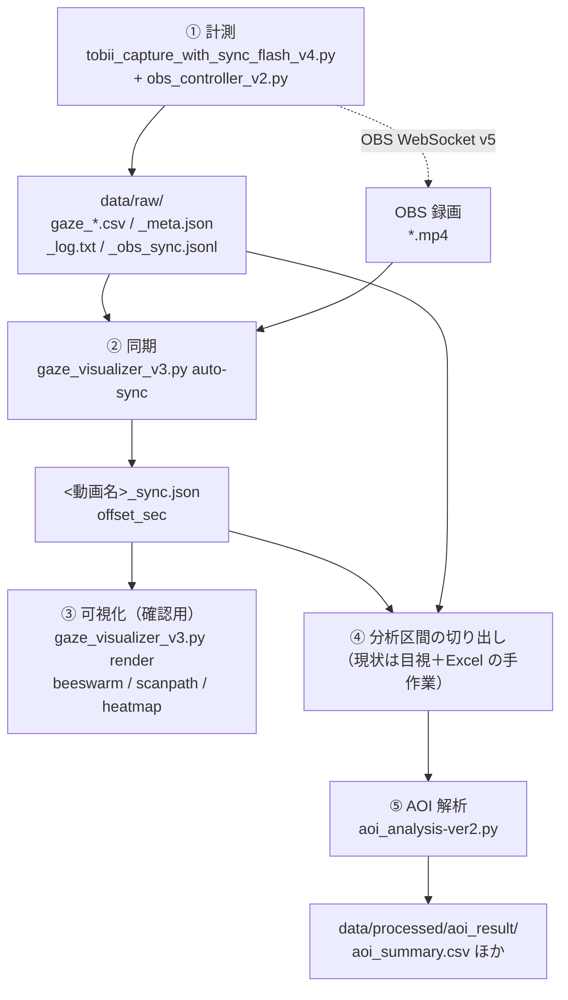

# fps-gaze-research_2026

卒業研究「**VALORANTにおけるHUD内情報への注意配分と熟練度の関係 ― AOI解析によるHUD要素別注視行動の分析 ―**」の計測・解析コード一式です。

Tobii Pro Spark で取得した視線データと OBS Studio の画面録画を時刻同期し、VALORANT の HUD を要素別の AOI（Area of Interest）に細分化して、熟練度（ランク）による注視行動の違いを定量的に比較します。

---

## 目次

1. [研究の概要](#1-研究の概要)
2. [全体のデータフロー](#2-全体のデータフロー)
3. [ディレクトリ構造](#3-ディレクトリ構造)
4. [セットアップ](#4-セットアップ)
5. [使い方](#5-使い方)
6. [データ仕様](#6-データ仕様)
7. [AOI 定義](#7-aoi-定義)
8. [守るべき制約](#8-守るべき制約)
9. [現在の進捗と既知の課題](#9-現在の進捗と既知の課題)
10. [関連ドキュメント](#10-関連ドキュメント)

---

## 1. 研究の概要

| 項目 | 内容 |
|---|---|
| 目的 | HUD（ミニマップ・HP／アーマー・弾数・アビリティ・クロスヘア周辺など）を AOI として細分化し、ランク群間で注視行動の違いを明らかにする |
| 研究の種類 | 実験的検証（ツール開発研究ではない） |
| 対象 | VALORANT／本実験：アンレート、予備実験：スイフトプレイ |
| 群分け | 低ランク群：アイアン1〜シルバー3 ／ 高ランク群：アセンダント1以上（各10名目標、未ランク者は原則除外） |
| 分析区間 | 購入フェーズ終了 → 死亡またはラウンド終了（＝生存中）。購入中・死亡後の観戦・試合開始前は主解析から除外 |
| 主指標 | AOI別 Gaze %（**有効サンプルベース**。分母＝分析区間内の有効サンプル数） |
| 副指標 | Fixation Count（有効分析時間1分あたりも算出）、Average Fixation Duration、Revisit Count |
| 探索指標 | TTFF（初回注視までの時間）、AOI間遷移 |
| 注視検出 | I-DT（分散閾値法）。開始案：最短 100 ms、分散閾値 1°（x範囲＋y範囲の和、視角） |
| 処理順 | 有効性判定 → 注視検出 → 注視への AOI 割り当て → 訪問・再訪の集計 |

動的な対象（敵モデル等）は AOI の対象外です。画面上の固定位置にある HUD 要素のみを扱います。

### 計測環境

| 機器・条件 | 内容 |
|---|---|
| アイトラッカー | Tobii Pro Spark（60 Hz、モニター下部中央に固定） |
| モニター | EIZO FlexScan EV2740X（27型・3840×2160・16:9） |
| 録画 | OBS Studio（**ディスプレイキャプチャ**。OBS WebSocket v5 経由で自動開始／停止） |
| ゲーム側 | VALORANT をウィンドウフルスクリーンで実行。実行ファイルの全画面最適化は無効 |
| 姿勢 | 眼−画面距離 約65 cm、顎台なし。椅子・モニター・Spark の位置を床／机のテープで固定 |
| 事前処理 | 各セッション前にキャリブレーション |
| 実行環境 | Windows + PowerShell（研究室PC） |

---

## 2. 全体のデータフロー



同期オフセットの計算式は次の通りです（`auto-sync` が自動で算出します）。

```
offset_sec = start_sync.delta_sec_confirmed_based + data_quality.first_sample.pc_time_sec
gaze_time(pc_time_sec) = video_time + offset_sec
```

`delta_sec_confirmed_based` は「Tobii の最初の視線サンプル到達時刻」と「OBS の録画開始**確認**イベント受信時刻」の差分です。2026-07-29/30 に実施した較正10セッション（N=10）で、実測オフセットとの差が1フレーム未満であることを検証済みです。

---

## 3. ディレクトリ構造

```
fps-gaze-research_2026/
│
├── README.md                  このファイル
├── CLAUDE.md                  AI コーディング支援向けの前提条件・不変条件
├── requirements.txt           依存パッケージ（※ 4章の注記を参照）
│
├── docs/                      研究ノート・仕様書・改良計画
│   └── IMPROVEMENT_PLAN.md      T0〜T9 の改良タスク定義（優先度つき）
│
├── data/                      測定データ（.gitignore 済み・Git 管理外）
│   ├── raw/                     計測したままの生データ
│   │     gaze_<subject>_<trial>_<condition>_<YYYYMMDD_HHMMSS>.csv
│   │     〃 _meta.json          セッション情報・同期情報・データ品質
│   │     〃 _log.txt            実行ログ
│   │     〃 _obs_sync.jsonl     OBS 同期イベントログ
│   ├── processed/               解析・可視化の出力
│   │   └── aoi_result/            AOI 解析結果（CSV / JSON）
│   └── annotations/             分析区間の定義ファイル（T3 で導入予定）
│
├── src/                       現行のソースコード
│   ├── obs_controller_v2.py     OBS WebSocket v5 制御（録画の自動開始／停止・同期ログ）
│   │
│   ├── gaze_estimation/         【計測】
│   │   └── tobii_capture_with_sync_flash_v4.py
│   │                             視線取得の本体（SCRIPT_VERSION 4.1.0-start-sync）
│   │                             計測の開始／終了は別端末のブラウザから HTTP で行う
│   │
│   ├── aoi_detector/            【AOI 定義・解析】
│   │   ├── valorant_hud_aoi_circular.json   ★ 現行の正式な AOI 定義
│   │   ├── valorant_hud_aoi.json            旧版（矩形のみ）
│   │   ├── aoi_config_example.json          記述形式のサンプル
│   │   ├── aoi_analysis-ver2.py             AOI 解析スクリプト（CLI）
│   │   ├── aoi_overlay.py                   AOI 枠を画面に重ねて位置を確認（矩形）
│   │   ├── aoi_overlay_shapes.py            〃（円形対応版）
│   │   └── README.txt                       出力ファイルの簡易説明
│   │
│   ├── visualizer/              【同期・可視化】
│   │   └── gaze_visualizer_v3.py  auto-sync / calibrate / render / live
│   │
│   └── test/                    【検証・補助ツール】
│       ├── sync_calibration_tool-v2.py  同期オフセットの実測検証（較正用・現行）
│       ├── sync_calibration_tool.py     〃 の旧版
│       ├── Checking_the_video.py        動画をフレーム単位で対話確認
│       ├── Checking_the_video-120fps.py 動画を 120 フレームごとに間引き確認
│       └── extract_frames.py            指定フレームを画像として書き出し
│
└── archive/                   旧バージョンのコード（参照専用・実行対象外）
```

**バージョン運用のルール**：新しい版は新しいファイル（`_v4`、`-ver2` など）として作り、旧版は**同じコミットで `archive/` に移動**します。生きている版を2つ残しません。

---

## 4. セットアップ

### 4.1 必要なもの

- Python 3.10 以降（Windows）
- Tobii Pro Spark 本体 + Tobii Pro Eye Tracker Manager（キャリブレーション用）
- OBS Studio 28 以降（OBS WebSocket v5 を内蔵）
- ffmpeg（`render` で音声を保持する場合のみ。PATH に通しておく）

### 4.2 インストール

```powershell
py -3 -m venv .venv
.\.venv\Scripts\Activate.ps1
python -m pip install --upgrade pip
pip install -r requirements.txt
```

> ⚠️ **`requirements.txt` は現在、実態とズレています**（`docs/IMPROVEMENT_PLAN.md` の T0 で修正予定）。実際に必要なのは次の通りです。
>
> | 用途 | パッケージ |
> |---|---|
> | 計測 | `tobii-research`, `pygame`, `screeninfo`, `obsws-python`, `pywin32`（Windows のみ） |
> | 解析 | `pandas`, `numpy` |
> | 可視化 | `opencv-python`, `numpy` |
> | AOI 位置確認 | `PyQt5` |
>
> `keyboard` は **Vanguard 対策により使用禁止**です（8章参照）。インストールもしないでください。

### 4.3 OBS 側の設定

1. OBS の「ツール → WebSocket サーバー設定」でサーバーを有効化し、パスワードを控える
2. 映像ソースは **ディスプレイキャプチャ**（画面キャプチャ）にする
   - ゲームキャプチャでは計測プログラム側のウィンドウが録画に映らず、同期の検証ができません
3. 録画フォーマット・解像度・FPS をセッション間で固定する

### 4.4 OBS 接続設定ファイル

パスワードをコマンド履歴やリポジトリに残さないため、**ローカル専用の JSON** に書いて渡します。

`obs_config.local.json`（リポジトリ直下に作成。`.gitignore` 対象）

```json
{
  "obs_enabled": true,
  "obs_host": "localhost",
  "obs_port": 4455,
  "obs_password": "OBS の WebSocket サーバー設定で表示されるパスワード",
  "obs_require_success": true,
  "obs_wait_for_started_event": true,
  "obs_timeout_sec": 3.0
}
```

すべてのキーは任意です。省略した項目は既定値（`localhost:4455`、タイムアウト 3.0 秒、`obs_require_success=true`）が使われ、コマンドライン引数（`--obs-host` など）で個別に上書きできます。

---

## 5. 使い方

以下は PowerShell での実行例です。Windows PowerShell 5.1 では `&&` が使えないため、連続実行は `; if ($?) { ... }` を使ってください。

### 5.1 ① 計測する

```powershell
python .\src\gaze_estimation\tobii_capture_with_sync_flash_v4.py `
    --subject S01 --trial 1 --condition unrated `
    --obs-config .\obs_config.local.json
```

起動すると、コンソールに**リモコン用の URL**（例 `http://192.168.x.x:8765/?token=xxxxxxxx`）が表示されます。同一 LAN 上のスマートフォン等のブラウザでこの URL を開き、画面のボタンで計測を開始／終了します。

> ゲーム PC 上でキーボードフックを使わないための設計です。キー入力による開始・終了は行いません（8章参照）。

主なオプション：

| オプション | 説明 |
|---|---|
| `--subject` / `--trial` / `--condition` | 出力ファイル名に入る識別子（既定：`NA` / `1` / `default`） |
| `--output-dir` | 出力先（既定：`data/raw`） |
| `--calibrate` | 起動時にキャリブレーションを実施する |
| `--skip-conditions-prompt` | 実験条件の対話入力をスキップする |
| `--max-duration` | 最大計測時間（秒）。超過で自動終了 |
| `--target-fps` | 想定フレームレート（Hz）。同期評価の「1フレーム未満か」の判定に使う |
| `--control-port` / `--control-token` | リモコンのポート／トークン（既定：8765／自動生成） |
| `--obs-config` | OBS 接続設定 JSON のパス |
| `--no-obs` | OBS 連携を無効化し、手動確認（y/n）にフォールバックする |
| `--obs-allow-gaze-only` | OBS 録画開始に失敗しても視線データのみで継続する |

出力（`data/raw/`）：

```
gaze_S01_1_unrated_20261019_143012.csv             視線データ本体
gaze_S01_1_unrated_20261019_143012_meta.json       セッション情報・同期情報・データ品質
gaze_S01_1_unrated_20261019_143012_log.txt         実行ログ
gaze_S01_1_unrated_20261019_143012_obs_sync.jsonl  OBS 同期イベントログ
```

録画した mp4 は OBS 側で設定した出力先に保存されます。

### 5.2 ② 動画と視線データを同期する

```powershell
python .\src\visualizer\gaze_visualizer_v3.py auto-sync `
    .\data\raw\gaze_S01_1_unrated_20261019_143012.csv `
    "C:\Users\kawalab\Videos\2026-10-19 14-30-20.mp4"
```

`_meta.json` の `start_sync` からオフセットを自動算出し、動画と同じ場所に `<動画名>_sync.json` として保存します。

| サブコマンド／オプション | 説明 |
|---|---|
| `auto-sync` | メタデータからオフセットを自動算出する（**推奨**） |
| `--verify` | 自動算出値を初期値として、目視でも確認してから保存する |
| `calibrate` | 目視で対話的にオフセットを決める（v4.1 未満のデータなど、auto-sync が使えない場合のフォールバック） |

> `--allow-request-based-fallback` は検証用です。`delta_sec_request_based` は卒論の集計には使いません。

### 5.3 ③ 可視化する（確認用）

```powershell
python .\src\visualizer\gaze_visualizer_v3.py render `
    .\data\raw\gaze_S01_1_unrated_20261019_143012.csv `
    "C:\Users\kawalab\Videos\2026-10-19 14-30-20.mp4" `
    --modes beeswarm scanpath heatmap `
    --out-dir .\data\processed\output_video\
```

モードごとに `<動画名>_beeswarm.mp4` のような別ファイルを出力します。

| オプション | 既定 | 説明 |
|---|---|---|
| `--modes` | 全モード | `beeswarm` / `scanpath` / `heatmap` から選択 |
| `--offset` | sync.json の値 | オフセットを手動指定する |
| `--heatmap-window` | 3.0 | ヒートマップの移動ウィンドウ秒数（0 で全累積） |
| `--scanpath-window` | 5.0 | スキャンパスの移動ウィンドウ秒数（0 で全累積） |
| `--beeswarm-trail` | 0.3 | Bee Swarm の軌跡表示秒数 |
| `--radius` | 14 | ヒートマップのガウシアン半径（px） |
| `--rec-width` / `--rec-height` | 動画と同じ | 録画時解像度が動画解像度と異なる場合に指定 |
| `--no-audio` | — | 音声合成をスキップする（ffmpeg 不要） |

`live` サブコマンドは CSV のみを再生するデバッグ用ビューワーです。

### 5.4 ④ 分析区間を切り出す（現状は手作業）

動画を目視で確認し、試合開始前・購入フェーズ・死亡後の観戦区間を Excel で削除した `*_proc.csv` を作成しています。

> ⚠️ この手順は**置き換え予定**です（`docs/IMPROVEMENT_PLAN.md` の T3）。行削除方式では、ラウンドをまたいで注視・訪問・遷移が連結されてしまい、分析時間（分母）も区間ごとに追えません。区間定義ファイル（`data/annotations/<session_base>_segments.csv`）と注釈ツールへ移行します。

### 5.5 ⑤ AOI 解析を実行する

```powershell
python .\src\aoi_detector\aoi_analysis-ver2.py `
    --input .\data\raw\gaze_S01_1_unrated_20261019_143012_proc.csv `
    --aoi .\src\aoi_detector\valorant_hud_aoi_circular.json
```

| オプション | 既定 | 説明 |
|---|---|---|
| `--input` | 必須 | 入力の視線 CSV |
| `--aoi` | 必須 | AOI 定義 JSON |
| `--output_dir` | `data/processed/aoi_result` | 出力先 |
| `--file_prefix` | なし | 出力ファイル名の接頭辞（例 `game01_`） |
| `--participant_id` / `--rank_tier` / `--session_id` / `--game_id` | なし | マスターテーブル集計用のメタ情報 |
| `--append_master_csv` | なし | セッション概要を横持ち1行として追記する（ランク群間比較用） |

出力（`data/processed/aoi_result/`）：

| ファイル | 内容 |
|---|---|
| `aoi_summary.csv` | AOI ごとのサンプル数・割合・推定滞在時間 |
| `aoi_sequence.csv` | 各時点の視線座標と所属 AOI |
| `aoi_fixation_metrics.csv` | AOI ごとの注視回数・平均注視時間など |
| `aoi_transitions.csv` | AOI 間の遷移（全ペアを網羅したロング形式） |
| `aoi_transitions_matrix.csv` | 同上（正方行列・人間可読／遷移エントロピー計算向け） |
| `dataset_overview.json` | 件数・有効率・推定サンプリング間隔・AOI カバレッジ・出所情報 |
| `dataset_overview.csv` | 旧形式（後方互換のため併存） |

> ⚠️ ver2 の `fixation_count` は「同一 AOI に属する連続サンプル区間（run）の数」であり、**注視検出を行っていません**。I-DT による再実装は T4 の対象です（9章参照）。

### 5.6 補助ツール

**AOI の位置を画面上で確認する**（試合中は起動しないこと）

```powershell
python .\src\aoi_detector\aoi_overlay_shapes.py --aoi .\src\aoi_detector\valorant_hud_aoi_circular.json
```

対象ディスプレイを選択すると AOI の枠が画面に重ねて表示されます。Enter で終了します。

**同期オフセットを実測検証する**（較正用。通常の計測では不要）

```powershell
python .\src\test\sync_calibration_tool-v2.py record --obs-config .\obs_config.local.json --duration-sec 20
python .\src\test\sync_calibration_tool-v2.py analyze --meta <record で出力された meta JSON>
```

**動画のフレームを確認する**

```powershell
python .\src\test\Checking_the_video.py .\data\raw\sample.mp4
python .\src\test\Checking_the_video-120fps.py .\data\raw\sample.mp4
```

---

## 6. データ仕様

### 6.1 視線 CSV の列

```
wall_timestamp_local, wall_timestamp_utc, pc_time_sec, device_time_stamp_us,
system_time_stamp_us, left_x, left_y, right_x, right_y, center_x, center_y,
left_gaze_point_validity, right_gaze_point_validity, gaze_missing
```

| 項目 | 内容 |
|---|---|
| 座標系 | Tobii display area の正規化座標（左上 `(0,0)`、右下 `(1,1)`）。画面外では 0 未満・1 超もあり得る |
| 欠測 | 文字列 `"NaN"`。`gaze_missing` は `True` / `False` の文字列 |
| `pc_time_sec` | **購読開始（gaze_subscribe_call）からの経過秒で、ホストのコールバック到着時刻**（`time.perf_counter()`）。デバイスの取得時刻ではない |
| 有効性の判定 | `gaze_missing` が False、かつ左右いずれかの validity が 1、かつ座標が非 NaN |

> **列・キーは削除・改名しない**（追加のみ）。過去セッションとの後方互換を維持するためです。

### 6.2 `_meta.json` の主なキー

| キー | 内容 |
|---|---|
| `script_version` | 計測スクリプトのバージョン |
| `start_sync` | `delta_sec_confirmed_based` ほか、開始同期の評価値 |
| `data_quality` | 有効サンプル率、`first_sample.pc_time_sec` など |
| `obs` | OBS 連携の設定値と制御結果 |

### 6.3 ファイル命名規則

```
gaze_<subject>_<trial>_<condition>_<YYYYMMDD_HHMMSS>.csv
```

---

## 7. AOI 定義

正式な定義ファイルは **`src/aoi_detector/valorant_hud_aoi_circular.json`** です。正規化座標で記述します。

| AOI 名 | 形状 | 対象 |
|---|---|---|
| `minimap` | circle | 左上のミニマップ |
| `crosshair` | circle | 画面中央のクロスヘア周辺 |
| `ally_team_status` | rectangle | 上部左の味方エージェント・生存状態 |
| `round_timer` | rectangle | 上部中央のラウンドタイマー |
| `enemy_team_status` | rectangle | 上部右の敵エージェント・生存状態 |
| `health_armor` | rectangle | 体力・アーマー |
| `abilities` | rectangle | アビリティ |
| `ammo_weapon` | rectangle | 弾数・武器 |
| `credits` | rectangle | クレジット |

いずれにも該当しない視線は `outside` として集計されます。`circle` の `radius_x` / `radius_y` は正規化座標上の半径で、基準解像度上で円形になるよう設定しています。

> ⚠️ **AOI 定義はこの画面・この解像度・16:9・この HUD 設定でのみ成立します。** 解像度を変えたり 4:3 ストレッチにしたりすると HUD 位置が変わり、定義が無効になります。
>
> ⚠️ 現在 `screen_name` が `valorant_hud_1366x768` のままです（実態は 3840×2160。`reference_resolution` は正しい値）。T0 で修正します。

---

## 8. 守るべき制約

### Vanguard（VALORANT のカーネルモード・アンチチート）

- ゲーム PC 上で **OS 全体のキーボード／マウスフックを使わない**。`keyboard` パッケージ等は禁止（BAN リスクが被験者アカウントに及ぶ）
- 試合中に**最前面オーバーレイ窓を出さない**。`aoi_overlay*.py`（PyQt5）は試合中に起動しない
- OBS は「ディスプレイキャプチャ」、VALORANT はウィンドウフルスクリーン、実行ファイルの全画面最適化は無効

### 同期

- 同期基準は `delta_sec_confirmed_based`。`request_based` は卒論の集計に使わない
- `first_sample.pc_time_sec` の補正項を省略しない
- `KNOWN_MEAN_SEC=0.0188` / `KNOWN_SD_SEC=0.0025` は 2026-07-29/30 の較正10セッション由来。変更する場合は根拠データを添える
- 残差バイアス 平均約 4.1 ms（最大約 7.8 ms）は卒論の限界として記載する前提

### 解析・データ管理

- **ゼロ件の AOI も出力から消さない**（明示的に 0 の行を出す）。「本当に見ていない」と「出力に無い」を区別できなくなる
- `data/raw` を上書きしない。派生物は `data/processed/` へ
- 区間除外は「行の削除」ではなく区間定義ファイルで行う。注視・訪問・遷移が区間境界や欠測ギャップをまたいで連結されてはならない
- 指標の定義・閾値を変えたら、出力に定義とパラメータを残す（provenance）
- **秘密情報（OBS WebSocket パスワード、制御 token）をコード・README・コミットに書かない**

### ブランチ運用

`main` は動作確認済みのもののみ。作業は `feature/xxx` / `fix/xxx` ブランチで行い、`main` に直接コミットしません。コミットメッセージは日本語で、何を・なぜ変えたかを書きます。

---

## 9. 現在の進捗と既知の課題

### これまでの経過

| 時期 | 内容 |
|---|---|
| 2026-07 | OBS WebSocket 連携による録画の自動開始／停止を実装。較正10セッション（N=10）で `delta_sec_confirmed_based` の妥当性を検証（実測との差は1フレーム未満） |
| 2026-08〜09 | 円形 AOI（ミニマップ・クロスヘア）に対応。可視化（beeswarm / scanpath / heatmap）を整備 |
| 2026-09 | 予備実験（スイフトプレイ、同一参加者5試合）を実施。有効サンプル率 95.87〜97.98%。視線は AOI 外とクロスヘア周辺に集中し、HUD ではミニマップが相対的に大きいという傾向を確認 |
| 2026-10 上旬 | 研究設計（群分け・分析区間・指標の定義）を確定。改良計画（T0〜T9）を策定 |
| 2026-10/19〜25 | 予備実験（アンレート）：取得 → 録画 → 同期 → 分析の通し確認 |
| 2026-10/26〜31 | 条件確定。**本実験前に計測コードを凍結**（以降の計測側の変更は不具合修正のみ） |
| 2026-11 | 本実験 |

### 既知の課題

| # | 課題 | 対応タスク |
|---|---|---|
| 1 | ver2 の「注視」が近似（run ベースで注視検出をしていない）。境界付近で run が水増しされ、平均注視時間が短く出る | T4 |
| 2 | 分析区間の除外が手作業の行削除。ラウンドや瞬目をまたいだ連結が起こりうる | T3 |
| 3 | 画面端の精度低下。ゼロ件 AOI（`round_timer`, `enemy_team_status`, `ammo_weapon`, `credits`）が「見ていない」のか「測れていない」のかを区別できていない | T2 / T5 |
| 4 | 眼−画面距離を記録していない（視角換算に必要） | T1 |
| 5 | AOI 設定の数値の根拠が不一致（crosshair 半径の視角、`screen_name`） | T0 / T5 |
| 6 | `requirements.txt` が実態と不一致 | T0 |

> 予備実験で観察された「ミニマップよりクロスヘアの平均注視時間が短い」は課題1の影響を受けている可能性が高いため、I-DT で再計算するまで卒論の結果としては扱いません。

---

## 10. 関連ドキュメント

| ファイル | 内容 |
|---|---|
| `docs/IMPROVEMENT_PLAN.md` | T0〜T9 の改良タスク定義（なぜ／何を／受け入れ基準／注意点） |
| `CLAUDE.md` | AI コーディング支援向けの前提条件・不変条件・コーディング規約 |
| `src/aoi_detector/README.txt` | AOI 解析の出力ファイル説明（簡易版） |
